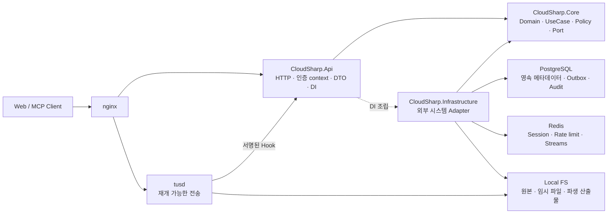
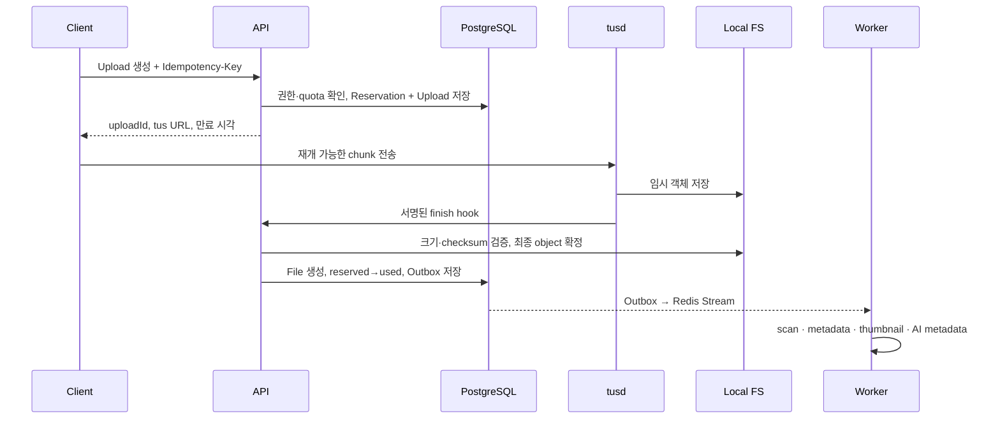
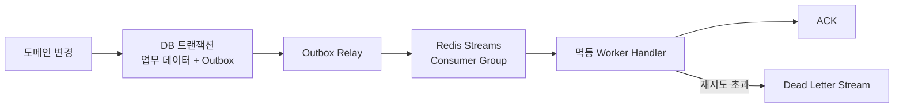

# CloudSharp 프로젝트 종합 개요

> 대상 릴리스: CloudSharp Production v1  
> 문서 성격: 제품 목표, 범위, 목표 아키텍처, 핵심 정책, 개발 로드맵을 연결하는 상위 개요  
> 기준일: 2026-07-20  
> 현재 단계: 프로젝트 골격 구성 완료, 기능 구현 착수 전

## 1. 한눈에 보기

CloudSharp는 개인 운영자와 소규모 팀이 자신의 인프라에서 직접 운영할 수 있는 **Space 기반 파일 저장·공유·협업 플랫폼**이다. 파일의 소유권, 저장 용량, 접근 권한을 개인 계정이 아닌 Space 단위로 관리하고, 내부 협업은 멤버십으로, 외부 전달은 만료 가능한 공유 링크로 분리한다.

Production v1은 기존 데모를 점진적으로 고치는 프로젝트가 아니다. 데모에서 검증한 사용자 흐름과 실패 사례만 참고하고, 새로운 코드베이스·데이터베이스 기준선·API 계약으로 다시 구축한다. 첫 릴리스는 단일 서버 셀프호스팅을 전제로 하며, 확장성보다 데이터 정합성, 인증·인가, 전송 신뢰성, 복구 가능성과 운영 가시성을 우선한다.

핵심 기술은 ASP.NET Core 10, PostgreSQL, Redis, tusd, .NET Worker, Local FS, nginx이며, 기본 구조는 `Api`, `Core`, `Infrastructure`의 3개 프로젝트로 구성한 Simplified Clean Architecture다.

## 2. 프로젝트 목표

### 2.1 제품 목표

- 사용자가 통제하는 인프라에 파일과 메타데이터를 저장한다.
- 대용량 파일을 중단 후 재개할 수 있고, 장애나 중복 요청에도 안전하게 완료한다.
- Space 단위의 권한과 quota를 모든 기능에서 일관되게 적용한다.
- 멤버십 기반 내부 협업과 링크 기반 외부 공유의 보안 경계를 분리한다.
- 파일 검색, 미리보기, 태그, 메타데이터와 MCP·AI 활용 경로를 안전하게 제공한다.
- 작업 유실, 데이터 불일치, 백업 실패를 운영자가 탐지하고 복구할 수 있게 한다.
- 빈 서버에서 설치, 첫 로그인, 업로드, 다운로드, 백업과 복구까지 재현 가능한 운영 패키지를 제공한다.

### 2.2 주요 사용자

| 사용자 | 필요한 가치 |
|---|---|
| 개인 운영자 | 설치·업데이트·백업·복구가 문서화된 셀프호스팅 환경 |
| 소규모 팀 | Space 공동 저장소, 단순하고 명확한 역할 관리 |
| 외부 공유 사용자 | 계정 없이도 안전하게 사용할 수 있는 제한된 공유 링크 |
| 시스템 관리자 | 사용자·Space·사용량·장애·감사 이력을 확인하고 통제하는 기능 |
| MCP·AI 클라이언트 | 명시적으로 허용된 scope와 Space 안에서의 검색·메타데이터 접근 |

### 2.3 설계 우선순위

의사결정 충돌 시 다음 순서로 판단한다.

1. 데이터 정합성과 복구 가능성
2. 인증·인가와 정보 노출 방지
3. 업로드·다운로드 신뢰성
4. 운영 가시성과 장애 대응
5. 향후 확장 가능한 경계
6. 구현 편의성과 기능 수

## 3. 범위

### 3.1 Production v1 필수 범위

| 영역 | 제공 기능 |
|---|---|
| 계정·세션 | 회원가입, 로그인, 로그아웃, 현재 사용자, 비밀번호 변경, 세션 폐기 |
| Space | 생성·조회·수정·삭제, 상태와 quota 관리 |
| 멤버십 | 초대, 수락, 역할 변경, 강퇴, 탈퇴, 마지막 Owner 보호 |
| 파일·폴더 | 탐색, 생성, 이름 변경, 이동, 검색, 휴지통, 복원, 영구 삭제 |
| 업로드 | quota 예약, tus 재개 업로드, 멱등 finalize, 만료·실패 정리 |
| 다운로드 | 단명 Download Grant, HTTP Range, 안전한 스트리밍 |
| 공유 | 파일·폴더 링크, 만료, 비밀번호, 활성화·폐기, 다운로드 정책 |
| 검색·태그 | Space 내 이름·기본 메타데이터 검색, 수동·자동 태그 |
| 후처리 | 유형 판별, 메타데이터, 썸네일, 보안 검사, AI 메타데이터 |
| 알림·실시간 | 영속 알림함, 읽음 위치, SSE 재연결과 누락 보충 |
| MCP | 별도 credential, scope·Space 제한, 검색·메타데이터 접근과 감사 |
| 관리자 | 사용자·Space·사용량·작업 실패·감사 이력 조회와 통제 |
| 운영 | Health check, 로그·메트릭·알림, migration, 백업·복구, 안전한 배포 |

### 3.2 Production v1 제외 범위

- Kubernetes, 자동 수평 확장, 다중 API 노드 고가용성
- PostgreSQL·Redis 자동 장애 조치
- S3·MinIO 프로덕션 저장소 어댑터
- 파일 버전 관리, WebDAV, 데스크톱 동기화
- 파일·폴더 단위 사용자별 ACL
- 결제, 요금제, 테넌트별 과금
- 의미 기반 벡터 검색의 운영 품질 보장

이 기능들을 막는 구조를 만들지는 않지만, v1 출시의 선행 조건으로 삼지 않는다.

## 4. 현재 구현 현황

2026-07-20 저장소를 직접 확인한 결과, 목표 디렉터리와 프로젝트 경계는 준비됐지만 제품 기능은 아직 구현되지 않았다.

| 항목 | 상태 | 근거 |
|---|---|---|
| Solution과 프로젝트 | 골격 완료 | `CloudSharp.Api`, `CloudSharp.Core`, `CloudSharp.Infrastructure`와 5개 테스트 프로젝트가 solution에 등록됨 |
| 의존성 방향 | 프로젝트 참조 수준에서 완료 | Core는 독립, Infrastructure는 Core만, Api는 Core와 Infrastructure를 참조 |
| API 실행 골격 | 최소 템플릿 | `Program.cs`는 OpenAPI 개발 노출과 HTTPS redirect만 구성 |
| 도메인·UseCase | 미착수 | 관련 폴더에는 책임을 설명하는 README만 존재 |
| DB·Redis·Storage 어댑터 | 미착수 | EF entity, migration, repository, Redis와 Local FS 구현 없음 |
| 인증·인가 | 미착수 | 세션 handler, 권한 policy, endpoint filter 없음 |
| 제품 Endpoint | 미착수 | Auth, Space, File, Upload 등 실제 endpoint 없음 |
| Worker·Outbox | 미착수 | 실행 모드와 job handler 구현 없음 |
| 자동화된 테스트 | 미착수 | 테스트 프로젝트와 폴더 골격만 존재 |
| 계약·배포·운영 | 문서 골격 | `contracts`, `deploy`, `ops`, `scripts`는 대부분 README placeholder |

현재 저장소의 1차 과제는 기능 수를 늘리는 것이 아니라 공통 primitive, 실제 Architecture Test, 공통 HTTP 오류 처리, 설정 검증, DbContext·트랜잭션 골격을 고정하는 것이다. 이후 Identity/Session을 첫 번째 종단 간 vertical slice로 구현한다.

## 5. 목표 아키텍처

### 5.1 논리 구성



### 5.2 계층별 책임

| 프로젝트 | 소유하는 책임 | 두지 않는 것 |
|---|---|---|
| `CloudSharp.Core` | Aggregate, value object, 상태 전이, 도메인 오류, command/query, use case, port, 권한·quota·보존 정책 | ASP.NET Core, HTTP DTO, EF Core, Redis, 파일 경로, 환경 변수 |
| `CloudSharp.Infrastructure` | EF Core, PostgreSQL, Redis, Local FS, token/password 처리, tus adapter, queue, 후처리 adapter | API DTO와 handler, 비즈니스 규칙과 권한 결정 |
| `CloudSharp.Api` | Minimal API, 인증 context, validation, HTTP 변환, OpenAPI, DI, 실행 모드 조립 | repository 직접 호출, 도메인 규칙 중복 구현 |

의존성은 `Api → Core`, `Api → Infrastructure`(조립 목적), `Infrastructure → Core`만 허용한다. 이 규칙은 향후 Architecture Test로 강제한다.

경계마다 모델을 분리한다. 예를 들어 같은 Space라도 API의 `CreateSpaceRequest`·`SpaceResponse`, Core의 `CreateSpaceCommand`·`SpaceSummaryDto`, Infrastructure의 `SpaceEntity`는 서로 다른 타입이다.

### 5.3 실행 및 배포 단위

| 실행 단위 | 역할 | 장애 시 원칙 |
|---|---|---|
| nginx | TLS 종료, same-origin routing, 보안 header와 전송 정책 | 재시작 후 upstream health 확인 |
| API | 외부·공개·내부 HTTP API | stateless 재시작, 진행 중 전송은 tusd가 유지 |
| tusd | 재개 가능한 업로드 수신 | 동일 upload URL로 재개 |
| Worker | Outbox relay, 후처리, 정리, 알림 projection | Redis pending 작업을 재수신 |
| PostgreSQL | 메타데이터, 트랜잭션, Outbox, Audit | 장애 시 fail closed, 백업 복구 사용 |
| Redis | 세션, rate limit, 단명 상태, durable stream | readiness 실패, Outbox가 미전달 작업 보존 |
| Local FS | 원본, 임시 파일, 썸네일 등 | 읽기·쓰기 차단 후 reconciliation |

API와 Worker는 컨테이너를 나누되 같은 3개 프로젝트 산출물을 서로 다른 실행 모드로 사용한다. Migration은 API 시작 시 자동 적용하지 않고 EF Migration bundle 또는 별도 migration job으로 실행한다.

## 6. 도메인과 데이터 구조

### 6.1 주요 도메인

| 영역 | 주요 Aggregate | 책임 |
|---|---|---|
| Identity | User, UserSession | 계정 상태, system role, password credential, 장치 세션과 폐기 |
| Collaboration | Space, SpaceMembership, SpaceInvite | 소유권, quota, 역할, 초대, 마지막 Owner 불변 조건 |
| Content | Folder, File, Tag | 논리 트리, 파일 메타데이터, 이름·이동, 태그 |
| Transfer | Upload, FileReservation, DownloadGrant, ShareLink | quota 선점, 전송 상태, 단명 권한, 외부 공유 정책 |
| Lifecycle | TrashOperation, FileAnalysis | 휴지통·복원·영구 삭제와 검사·메타데이터 상태 |
| Integration | Notification, McpCredential | 영속 알림, 읽음 cursor, MCP scope와 허용 Space |
| Operations | OutboxEvent, WorkerJob, AuditEvent | 작업 전달, 재시도·DLQ, 보안·운영 감사 |

### 6.2 데이터 저장소 역할

- **PostgreSQL**: 업무 데이터의 기준 저장소다. 사용자, Space, 콘텐츠 메타데이터, 업로드·공유 상태, 알림, MCP credential, Outbox, Worker 실행 이력, 감사 이벤트를 보관한다.
- **Redis**: opaque 세션, rate limit, Download Grant 같은 단명 상태와 Redis Streams 기반 작업 전달에 사용한다. 영구 업무 데이터의 유일한 원천으로 사용하지 않는다.
- **Local FS**: 임시 업로드, 확정 원본, 썸네일과 파생 산출물을 보관한다. 사용자에게 보이는 폴더 트리와 물리 경로는 분리한다.

### 6.3 식별자와 동시성

- DB 내부 PK/FK는 `BIGINT`, 외부 공개 ID는 Core가 생성한 UUIDv7 `publicId`를 사용한다.
- 내부 `long Id`는 API 응답, 공개 이벤트, URL에 노출하지 않는다.
- 변경 가능한 주요 Aggregate는 `version`으로 optimistic concurrency를 지원한다.
- 시간은 UTC `TIMESTAMPTZ`, JSON은 `JSONB`, 상태는 PostgreSQL ENUM을 기본으로 한다.
- ENUM 값 추가는 허용하지만 삭제·이름 변경은 호환 migration 없이 금지한다.
- 삭제 FK는 기본적으로 `RESTRICT`이며, 명시적인 연결 테이블만 cascade를 허용한다.

### 6.4 파일과 quota 정합성

업로드 허용 조건은 다음과 같다.

```text
usedBytes + reservedBytes + requestedBytes <= allowedBytes
```

quota 예약과 Upload 생성, finalize 완료와 `reserved → used` 전환은 각각 동일한 DB 트랜잭션에서 처리한다. 파일의 이름이나 폴더를 바꿔도 물리 object는 이동하지 않는다. 정기 reconciliation이 DB 참조, 실제 object, 임시 파일, 예약과 quota 집계를 비교한다.

## 7. 핵심 처리 흐름

### 7.1 인증과 인가

1. 로그인 성공 시 최소 256-bit CSPRNG opaque token을 발급한다.
2. 원문은 응답에서 한 번만 전달하고, 서버에는 단방향 hash와 세션 메타데이터만 저장한다.
3. 요청마다 계정 상태와 최신 권한을 확인하여 actor를 구성한다.
4. ASP.NET Authorization Policy가 전역 actor 조건을, Endpoint Filter가 Space와 리소스 권한을 검사한다.
5. Core UseCase가 중요 상태 변경 직전 핵심 불변 조건과 권한을 다시 확인한다.
6. 민감한 성공·실패는 AuditEvent로 기록한다.

Space 기본 역할은 `OWNER > ADMIN > MEMBER > VIEWER`다. Viewer는 읽기만 가능하고, Member부터 콘텐츠 변경이 가능하며, Admin은 멤버를 관리한다. quota 변경과 Space 삭제는 Owner만 할 수 있다. 마지막 Owner는 강등·탈퇴·강퇴할 수 없고, 권한 거부가 리소스 존재를 노출할 수 있는 경우 `404`로 마스킹한다.

MCP credential은 사용자 세션과 분리한다. `spaces:read`, `files:read`, `files:write`, `search:read`, `metadata:read` 등의 scope, 허용 Space, 사용자 계정 상태와 실제 Space membership의 교집합만 허용한다.

### 7.2 업로드



Upload는 `CREATED → UPLOADING → FINALIZING → COMPLETED`로 진행하며, 어느 단계에서나 조건에 따라 `FAILED`, `EXPIRED`, `ABORTED`로 종료할 수 있다. 생성과 finalize는 멱등해야 하며, 중복 hook, object 이동 후 DB 실패, DB commit 후 relay 중단을 복구할 수 있어야 한다.

### 7.3 다운로드와 공개 공유

인증 사용자는 파일 접근 권한을 검사받고 TTL이 짧은 Download Grant를 발급받는다. 실제 스트림 요청은 grant, 파일 상태, Space 범위, 만료와 폐기를 다시 검사하며 단일 HTTP Range 요청을 지원해 `200`, `206`, `416`을 정확히 반환한다.

외부 공유는 ShareLink token, 선택적 비밀번호, 만료, 활성 상태와 다운로드 허용 정책을 검증한 뒤 별도의 Download Grant를 발급한다. 공개 응답은 대상 존재 여부나 계정·Space 정보를 불필요하게 노출하지 않는다. 격리·삭제·접근 제한 파일은 기존 grant가 있더라도 정책에 따라 차단한다.

### 7.4 비동기 작업과 실시간 알림



Redis Pub/Sub은 durable job에 사용하지 않는다. Worker는 pending reclaim, 제한된 재시도, DLQ와 `jobId` 멱등성을 지원한다. 처리 대상은 파일 검사·메타데이터·썸네일·AI 메타데이터, 만료 업로드 정리, 휴지통 purge, storage reconciliation, 알림 projection이다.

사용자 알림의 기준은 PostgreSQL의 Notification row다. SSE는 빠른 알림을 위한 best-effort 채널이므로, 클라이언트는 재연결 시 notification cursor로 누락분을 다시 조회한다.

## 8. API 계약 원칙

| 구분 | 기준 |
|---|---|
| 인증·업무 API | `/api/v2` |
| 공개 공유·다운로드 | `/public/v2` |
| tusd hook·내부 운영 | `/internal/v2` |
| JSON | `camelCase` |
| ENUM | `UPPER_SNAKE_CASE` |
| 시간 | UTC ISO 8601 |
| 크기 | byte 단위 64-bit integer |
| 목록 | cursor pagination |
| 동시성 | 변경 요청의 ETag/버전 조건 |
| 재시도 안전성 | 필요한 mutation의 `Idempotency-Key` |

예상 가능한 비즈니스 실패는 안정적인 error code와 적절한 4xx로 반환한다. 내부 예외, SQL, 파일 경로와 token 존재 여부는 노출하지 않는다.

```json
{
  "requestId": "01J...",
  "error": {
    "code": "UPLOAD_QUOTA_EXCEEDED",
    "message": "The upload exceeds the space quota.",
    "details": [
      { "field": "sizeBytes", "code": "QUOTA_EXCEEDED" }
    ]
  }
}
```

`code`는 클라이언트 분기에 사용하고 릴리스 간 의미를 유지한다. `message`는 사람을 위한 설명이며 클라이언트 로직에 사용하지 않는다.

## 9. 보안 원칙

- 세션, 초대, 공유 링크, Download Grant, MCP, 내부 hook token 원문은 저장·로그하지 않는다.
- 비밀번호는 Argon2id 또는 승인된 강도의 ASP.NET Core PasswordHasher로 저장한다.
- 외부 트래픽은 TLS 1.2 이상, HSTS와 보안 header를 적용한다.
- sample secret이나 알려진 기본 secret이면 애플리케이션 시작을 거부한다.
- 로그인, 공개 공유, 사용자 API, MCP API에 주체별 rate limit을 적용한다.
- 파일명, MIME, `Content-Disposition`, preview를 서버 기준으로 sanitize한다.
- HTML·SVG 같은 active content는 attachment 또는 sandboxed preview로 제한한다.
- 악성 또는 미검사 정책 대상 파일은 quarantine하고 다운로드·공유를 차단한다.
- Local FS adapter는 path traversal과 symbolic link를 통한 root 탈출을 차단한다.
- CI의 dependency, container, secret scan에서 미해결 Critical/High 취약점을 차단한다.

## 10. 신뢰성, 관측성, 운영

### 10.1 목표 수준

| 항목 | Production v1 목표 |
|---|---|
| 월 가용성 | 계획 점검 제외 99.5% |
| 일반 metadata API | 정상 부하 p95 500 ms 이하, p99 1 s 이하 |
| 로그인 | p95 800 ms 이하 |
| 폴더 목록·검색 | Space당 100만 항목 시험에서 p95 1 s 이하 |
| 최대 단일 파일 | 기본 10 GiB, 설정 가능 |
| Worker 시작 지연 | 정상 상태 p95 30초 이하 |
| PostgreSQL·파일 RPO | 24시간 이하 |
| 전체 서비스 RTO | 4시간 이하 |
| 휴지통 보존 | 기본 30일 |
| 감사 로그 보존 | 기본 1년 |

초기 성능 기준 환경은 8 vCPU, RAM 16 GB, SSD/NVMe, 1 Gbps 네트워크의 단일 서버다. 실제 배포 장비에서 다시 기준선을 측정한다.

### 10.2 로그와 메트릭

모든 요청과 작업은 구조화된 JSON 로그를 사용하며 `traceId`, `correlationId`, `userId`, `spaceId`, `jobId`, `errorCode`, `elapsedMs` 등으로 연결 가능해야 한다. 예상 가능한 비즈니스 실패는 Error로 기록하지 않고, 처리되지 않은 시스템 장애만 전역 경계에서 한 번 Error로 기록한다.

token, password, Authorization header, cookie, raw body, 원본 파일명·경로·storage key는 로그에 남기지 않는다. API latency와 status, DB pool, Redis latency, upload 상태, Outbox lag, Stream pending, retry·DLQ, storage 사용량, backup 상태를 metric과 alert로 연결한다.

### 10.3 Health check

- `/health/live`: 프로세스가 생존하고 fatal 상태가 아닌지 확인한다.
- `/health/ready`: PostgreSQL, Redis, storage read/write probe, migration version을 확인한다.
- Worker health: DB·Redis Stream·storage 연결과 heartbeat를 확인한다.

상세 연결 문자열과 내부 상태는 외부 health 응답에 노출하지 않는다.

### 10.4 백업과 복구

PostgreSQL logical backup과 Local FS snapshot을 동일한 manifest ID로 묶어 매일 수행한다. manifest에는 앱·migration 버전, 생성 시각, checksum을 기록하고, 백업을 서비스 서버와 다른 위치로 복제한다. 기본 보존은 일간 7개, 주간 4개, 월간 6개다.

복구 시 쓰기를 중단하고 storage, DB 순으로 복원한 뒤 reconciliation을 dry-run한다. 누락 object와 orphan object를 확인·격리하고 readiness와 smoke test를 통과한 뒤 트래픽을 연다. 월 1회 별도 환경에서 RPO 24시간, RTO 4시간 목표를 검증한다.

## 11. 테스트와 품질 전략

| 테스트 프로젝트 | 검증 대상 |
|---|---|
| `CloudSharp.Core.Tests` | Aggregate 상태 전이, 정책, quota, UseCase의 성공·비즈니스 실패 |
| `CloudSharp.Infrastructure.Tests` | EF mapping, repository, Redis, Local FS, token hash와 storage safety |
| `CloudSharp.Api.IntegrationTests` | 실제 HTTP 계약, 인증·인가, ProblemDetails, OpenAPI |
| `CloudSharp.Worker.IntegrationTests` | Outbox, Redis Streams, pending reclaim, DLQ, cleanup, 멱등성 |
| `CloudSharp.Architecture.Tests` | 계층 의존성, namespace, endpoint 규칙과 DTO 경계 |
| `CloudSharp.TestSupport` | Testcontainers fixture, builder, fake, 공통 assertion과 데이터셋 |

통합 테스트는 실제 PostgreSQL·Redis와 ASP.NET Core Test Host를 Testcontainers로 실행한다. Docker가 없으면 성공으로 건너뛰지 않는다. CI는 build, 전체 테스트, OpenAPI lint와 breaking change, 빈 DB migration, secret·dependency·container scan, 이미지 build와 Migration bundle 생성을 검증한다.

각 기능은 `설계 확인 → 계약 확정 → Core → Core 테스트 → Infrastructure → 통합 테스트 → API → API 테스트 → 계약 갱신 → 운영 연결`의 vertical slice로 완료한다.

## 12. 개발 로드맵

### Phase 0 — 설계 기준 확정

용어와 범위, OpenAPI v2, ERD, 권한표, 오류 카탈로그, 이벤트·job schema, ADR과 프론트 v1→v2 대응표를 확정한다.

### Phase 1 — 기반 구축

공통 Result·오류·PublicId·시간 추상화, ProblemDetails와 correlation, typed options, DbContext·트랜잭션, Architecture Test, 인증·세션·rate limit, Outbox·Redis Streams, CI와 관측성 기반을 구현한다.

### Phase 2 — 핵심 파일 플랫폼

Space·Membership·Permission, Folder·File, quota·reservation, tus upload·finalize, cleanup·reconciliation, Download Grant·Range stream, ShareLink, 검색·태그, 휴지통, 백업·복구를 구현한다.

### Phase 3 — 비동기·MCP·AI

Worker 실행 모드, metadata·thumbnail·file scan·quarantine, 알림·SSE, MCP credential·tool, AI metadata, AuditEvent를 완성한다.

### Phase 4 — 운영 출시

Production Compose, migration·rollback runbook, dashboard·alert, 보안·부하·대용량 검증, 복구 리허설과 최종 출시 승인을 수행한다.

저장소 골격 기준으로는 **Phase 1의 첫 단계에 진입**했지만, OpenAPI v2·ERD·권한표·오류 카탈로그·이벤트 schema 등 Phase 0의 승인 산출물은 아직 완성되지 않았다. 따라서 공식 진행 상태는 **Phase 0과 Phase 1 기반 작업이 겹쳐 있는 상태**로 본다. 권장 바로 다음 순서는 다음과 같다.

1. Core 공통 primitive와 실제 Architecture Test 구현
2. 공통 HTTP 오류·validation·correlation과 Infrastructure DI·DbContext 골격
3. Identity/UserSession 기반 인증 vertical slice
4. Space/Membership/Authorization으로 권한 모델 확정
5. Folder/File/Upload으로 핵심 콘텐츠 흐름 구현
6. Download/Share/Trash와 Outbox/Worker/Notification 연결
7. MCP/Admin/운영 자동화와 출시 검증

## 13. 출시 완료 조건

다음 조건을 모두 충족해야 Production v1 출시로 판단한다.

- 모든 P0와 출시 필수 P1 작업 완료
- OpenAPI, ERD, 권한표, 오류·이벤트 계약과 구현 일치
- 전체 unit·integration·worker·architecture test와 CI 성공
- 미해결 Critical/High 보안 취약점 0건
- 권한 침범, token 유출, path traversal, quarantine 차단 검증 성공
- 중단 업로드 재개, 중복 hook, finalize 장애 복구 성공
- Worker pending recovery, Redis 장애 후 작업 유실 0건, DLQ 검증 성공
- 기본 10 GiB 전송과 목표 동시성·응답시간 시험 성공
- PostgreSQL·Local FS 백업 복구 리허설에서 RPO·RTO 충족
- 빈 서버의 production Compose 설치와 rollback 절차 성공
- MCP scope, 허용 Space, 최신 membership과 감사 검증 성공

## 14. 주요 위험과 대응

| 위험 | 영향 | 설계 대응 |
|---|---|---|
| DB와 파일시스템의 원자성 부재 | 고아 파일 또는 누락 object | 복구 가능한 finalize 순서, Outbox, 주기적 reconciliation과 quarantine |
| 중복 hook·job·클라이언트 재시도 | 중복 파일·과금·후처리 | Idempotency-Key, 상태 조건부 update, `jobId` 멱등 handler |
| 권한 변경과 기존 세션·grant | 권한 회수 지연 | 요청 시 최신 계정·membership 확인, 짧은 grant TTL, 중요 작업 재검증 |
| Redis 장애 | 로그인·rate limit·작업 전달 중단 | readiness fail closed, PostgreSQL Outbox에 미전달 작업 보존 |
| 단일 서버 장애 | 전체 서비스 중단 | 외부 백업, 복구 runbook, 월별 복구 리허설; HA는 v1 이후 |
| Local FS 용량·경로 문제 | 업로드 실패 또는 보안 사고 | 여유 공간 감시, 경로 정규화, root 탈출 차단, storage alert |
| 설계와 구현의 불일치 | 클라이언트·운영 오류 | 계약 우선 변경, Architecture Test, OpenAPI·migration 검증 |

## 15. 확정 가정과 문서 우선순위

- 기존 데모 코드와 데이터는 프로덕션으로 복사·이관하지 않는다.
- 프론트 사용자 흐름은 유지하지만 `/api/v1` 하위 호환성은 보장하지 않는다.
- Production v1은 단일 서버와 Local FS를 지원한다.
- MCP·AI·Worker는 v1 필수 범위다.
- 다중 노드 HA와 S3·MinIO는 v1 이후 과제다.

설계 충돌 시 다음 우선순위를 적용한다.

1. [프로덕션 백엔드 신규 구축 기획서](../.llm/%EB%B0%B1%EC%97%94%EB%93%9C%20%ED%94%84%EB%A1%9C%EB%8D%95%EC%85%98%20%EC%8B%A0%EA%B7%9C%20%EA%B5%AC%EC%B6%95%20%EA%B8%B0%ED%9A%8D%EC%84%9C.md)
2. [설계 목록](../.llm/%EC%84%A4%EA%B3%84%20%EB%AA%A9%EB%A1%9D.md)
3. `.llm/domains`, `.llm/database`, `.llm/auth`, `.llm/api`, `.llm/pipeline`, `.llm/log`의 영역별 상세 문서
4. 승인된 OpenAPI·ERD·권한·오류·이벤트 계약과 ADR

본 문서는 전체 방향을 빠르게 이해하기 위한 연결 문서다. 세부 구현 전에 [설계 문서 인덱스](../.llm/index.md)의 작업별 진입 지점과 [개발 진행 체크리스트](../.llm/development-checklist.md)를 함께 확인한다. 구현 상태가 바뀌면 이 문서의 기준일과 **4. 현재 구현 현황**, **12. 개발 로드맵**을 우선 갱신한다.

## 16. 용어

| 용어 | 의미 |
|---|---|
| Space | 파일 소유권, 멤버십, 권한과 quota의 기본 경계 |
| PublicId | 외부에 노출하는 UUIDv7 식별자 |
| Opaque token | 자체 내용을 해석하지 않고 서버 저장 상태로 검증하는 임의 token |
| Reservation | 업로드 전에 파일명과 quota를 임시 선점한 상태 |
| Download Grant | 다운로드 1건을 허용하는 TTL이 짧은 capability token |
| Outbox | 업무 DB commit과 이벤트 기록을 같은 트랜잭션으로 묶는 패턴 |
| Redis Streams | Consumer Group과 pending recovery를 지원하는 durable 작업 전달 채널 |
| Reconciliation | DB와 storage·queue 상태를 비교해 불일치를 탐지·복구하는 작업 |
| Quarantine | 안전성 검증에 실패했거나 확인이 필요한 파일의 접근 차단 상태 |
| Vertical slice | 한 기능을 Core부터 API·테스트·계약·운영까지 종단 간 완성하는 작업 단위 |
